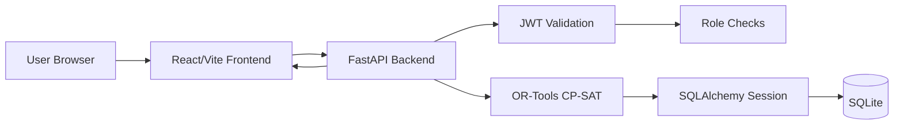

# Architecture

## System Overview

The Construction Equipment Allocation System is a three-layer web application:

- Frontend: React, TypeScript, Vite, Tailwind CSS.
- Backend: FastAPI, SQLAlchemy, Pydantic, JWT auth.
- Scheduler: Google OR-Tools CP-SAT.
- Persistence: SQLite through SQLAlchemy.

The browser authenticates with the backend, receives a bearer token, and then
calls the FastAPI API with that token. FastAPI validates the token, applies
role checks, and routes requests through the scheduler before persisting.

## Component Diagram

## Frontend Architecture

Important folders:

- `frontend/src/pages` - route-level screens: Dashboard, New Booking, Fleet,
  Conflict Log, Override Panel.
- `frontend/src/components` - layout and login components.
- `frontend/src/lib/api.ts` - axios client that attaches the bearer token.

Key frontend decisions:

- React Router routes for dashboard, booking, fleet, conflicts, and overrides.
- Dark/light theme based on the operating-system preference, with a manual toggle.
- The booking form validates dates on the client before calling the API.
- The dashboard computes utilization and activity from live API responses.

## Backend Architecture

Important files:

- `backend/main.py` - FastAPI app, CORS, startup seeding.
- `backend/api.py` - REST route handlers.
- `backend/scheduler.py` - OR-Tools conflict-resolution engine.
- `backend/models.py` - SQLAlchemy models.
- `backend/schemas.py` - Pydantic request/response models.
- `backend/auth.py` - password hashing, JWT creation and validation, RBAC.
- `backend/seed.py` - deterministic demo data seed.
- `backend/tests/test_api.py` - pytest suite.

Backend principles:

- Routes stay thin and delegate business rules to the scheduler.
- Business rules are deterministic and testable.
- Password hashing uses bcrypt; no plaintext credentials are stored.
- JWT tokens expire after 30 minutes.
- Role checks protect maintenance creation and override operations.

## Data Flow

### Login

1. User submits username and password.
2. Backend verifies the password with bcrypt.
3. Backend returns a signed JWT containing the user id and role.
4. Frontend stores the token and role in localStorage.
5. API client sends `Authorization: Bearer <token>` on later requests.

### Create Booking

1. User submits equipment, site, dates, priority, and shift.
2. Backend validates date ordering and equipment existence.
3. Backend checks maintenance windows with shift-aware logic.
4. Scheduler resolves conflicts against existing approved bookings.
5. If accepted, lower-priority overlapping bookings are marked displaced.
6. The new booking is persisted with status `approved`.

## Deployment Shape

Local development:

- Backend: `http://127.0.0.1:8000`.
- Frontend: `http://127.0.0.1:5173`.
- Database: SQLite file at `backend/equipment.db`.

Optional Docker:

- `docker compose up --build` starts backend on 8000 and frontend on 5173.

Production-ready path:

- Host the React static build behind HTTPS.
- Host FastAPI behind an HTTPS gateway.
- Replace SQLite with a server database and add migrations.
- Keep secrets in environment variables.
- Add CI jobs for tests and build.